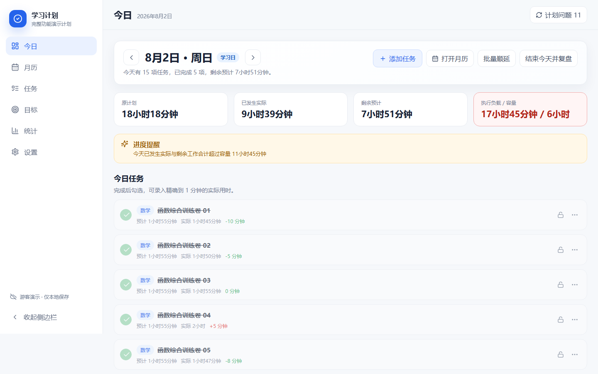
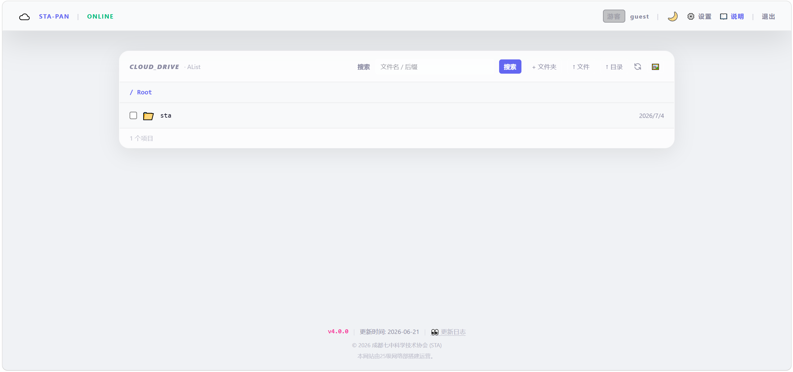
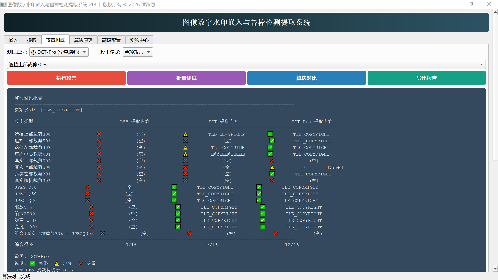

# Hi, I'm yhwlwl 👋

High school student at Chengdu No. 7 High School  
Always learning, always exploring.

I build tools for learning, campus services, full-stack systems, and digital watermarking research.

---

你好，我是 yhwlwl，成都七中的一名高中生。我习惯把学习与生活中遇到的具体问题拆解成需求，再把它做成能真正运行的东西：从学习计划、校园文件服务，到数字水印研究，每一个项目都经历过"发现问题 → 设计 → 实现 → 部署 → 复盘改进"的完整过程。

我还在持续学习，目前的关注方向包括：

- 学习效率工具与个人计划系统；
- 校园服务与全栈 Web 系统；
- 文件平台、访问控制与多线路传输；
- 数字图像水印的算法研究与可视化。

## 精选项目

### Study Planner

目标驱动、可解释、可恢复的动态学习计划系统。围绕计划生成、实际执行、复盘、冲突处理与调整预览形成闭环：任何改动先解释、先预览，确认后才应用，并且可以恢复到之前的版本。

- 仓库：[github.com/yhwlwl/study-planner](https://github.com/yhwlwl/study-planner)
- 技术栈：React、TypeScript、Vite、PWA、Supabase、IndexedDB

### STA-PAN（bd-pan）

面向校园文件访问场景的权限化文件平台。整合 AList 存储桥接、Web 前端、服务端网关、数据库、预览、日志与多线路下载，解决网盘分享中的权限、下载限制与预览问题。支持游客进入，权限由管理员按角色和路径规则控制。

- 仓库：[github.com/yhwlwl/bd-pan](https://github.com/yhwlwl/bd-pan)
- 在线 Demo：[pan.stacdqz.tech](https://pan.stacdqz.tech)（游客可进入）
- 技术栈：Next.js、React、AList、PostgreSQL、PDF.js

### DCT-Pro Watermark

数字图像水印研究项目：交互式算法可视化、研究说明与 Windows 可执行演示程序（研究实现源码不公开）。提供 LSB / DCT / Visible / DCT-Pro 四种模式的嵌入、提取、质量评估与批量攻击测试。

- 仓库：[github.com/yhwlwl/watermark](https://github.com/yhwlwl/watermark)
- Release：[DCT-Pro Research Workbench v13 for Windows](https://github.com/yhwlwl/watermark/releases/tag/v13.0)（`v13_ex.exe`，含 SHA-256）
- 技术栈：Python、PyQt6、OpenCV、交互式 Web 可视化

## 其他项目

- **pan-wlm** — 未来梦杂志在线阅读平台，与 STA-PAN 同源，特色是防下载权限拦截：[仓库](https://github.com/yhwlwl/pan-wlm) · [在线站点](https://wlm.stacdqz.tech)
- **sleep** — 面向教室大屏午休场景的简洁倒计时工具（Web + Electron）：[仓库](https://github.com/yhwlwl/sleep)
- **magic** — 伪装成普通计算器的互动魔术网页：[仓库](https://github.com/yhwlwl/magic)

## 技术与工具

在项目中使用过：React、TypeScript、Next.js、Vite、Tailwind CSS、Python、Electron、PostgreSQL、Supabase、AList、GitHub Actions、GitHub Pages、Vercel 等。这些只是"用过且继续在学"的工具，不是自我评级的依据。

## 正在推进的方向

- Study Planner 的排期算法优化；
- STA-PAN 系列平台的访问控制与阅读体验；
- DCT-Pro 2.0的设计与开发。

## 说明

这里展示的项目都来自真实需求，处于"持续迭代"状态：有的已稳定服务内部使用，有的仍是研究原型或创意项目。欢迎浏览各仓库的 README 与文档索引，了解每个项目的具体边界。

## 联系

可以通过 GitHub 与我交流（Issues / Discussions），也可以在对应仓库中提交问题反馈。
