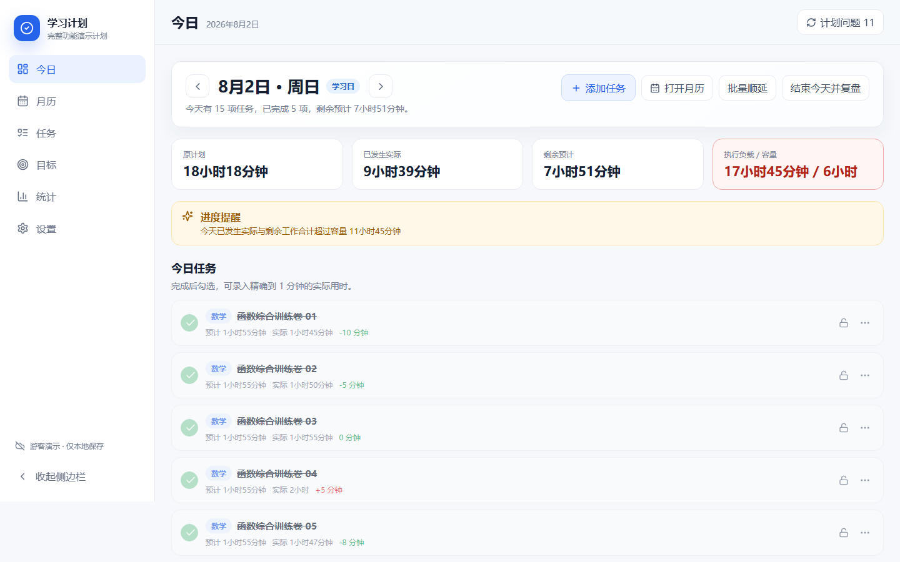
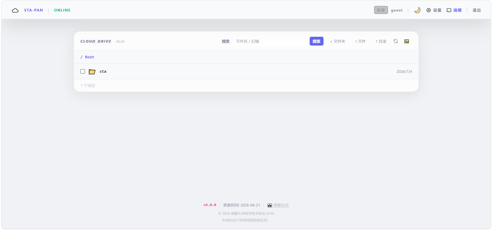
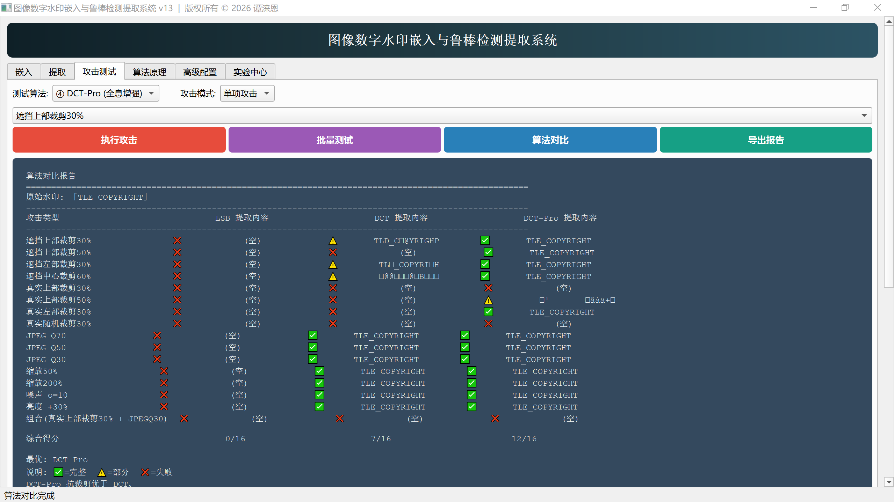

# Hi, I'm yhwlwl 👋

High school student at Chengdu No.7 High School  
Always learning, always exploring.

I build tools for learning, campus services, full-stack systems, data-driven products, and visual / algorithmic experiments.

---

你好，我是 yhwlwl @ cdqz。我习惯把学习与生活中遇到的具体问题拆解成需求，再把它做成能真正运行的东西：从学习计划、考试成绩分析、校园文件服务，到数字水印研究和校园文化粒子作品，每一个项目都尽量经历“发现问题 → 设计 → 实现 → 部署 → 真实使用 → 复盘改进”的完整过程。

我还在持续学习，目前的关注方向包括：

- 学习效率工具、计划系统与成绩分析；
- 校园服务与全栈 Web 系统；
- 数据产品、行为分析与反馈闭环；
- 文件平台、访问控制与多线路传输；
- 数字图像水印、统计分析与交互式可视化；
- 粒子系统与校园文化数字化表达。

## 精选项目

### Score Tracker

面向长期考试记录的成绩轨迹与分析系统。除了目标分 / 实际分，还记录原始分、赋分 / 最终分、年级 / 班级 / 市区排名、位比、参考人数、科目组合与长期目标，并通过趋势图、雷达、排名分析和深度分析 Beta 去理解长期变化。

项目已经从个人原型进入真实使用阶段。**截至 2026-08-29，生产 Supabase 中已有 9,600+ 个非管理员账号记录、8,800+ 场考试、62,000+ 条单科成绩记录；当前行为分析口径累计 13,000+ Visitor、24,000+ Session 和 240,000+ 产品事件。**

- 仓库：[github.com/yhwlwl/score-tracker](https://github.com/yhwlwl/score-tracker)
- 当前版本：v6.0
- 核心能力：目标 / 实际成绩、原始分 / 赋分、排名与位比、科目组合、长期目标、数据导出、反馈闭环、私有运营后台
- 深度分析 Beta：下场名次预测与 95% 区间、趋势 / 变点检验、异常提醒、分布与状态分析
- 技术栈：HTML、CSS、Vanilla JavaScript、Supabase Postgres / Edge Functions / Storage、Vercel

### Study Planner

目标驱动、可解释、可恢复的动态学习计划系统。围绕计划生成、实际执行、复盘、冲突处理与调整预览形成闭环：任何改动先解释、先预览，确认后才应用，并且可以恢复到之前的版本。

- 仓库：[github.com/yhwlwl/study-planner](https://github.com/yhwlwl/study-planner)
- 技术栈：React、TypeScript、Vite、PWA、Supabase、IndexedDB

### STA-PAN（bd-pan）

面向校园文件访问场景的权限化文件平台。整合 AList 存储桥接、Web 前端、服务端网关、数据库、预览、日志与多线路下载，解决网盘分享中的权限、下载限制与预览问题。支持游客进入，权限由管理员按角色和路径规则控制。

- 仓库：[github.com/yhwlwl/bd-pan](https://github.com/yhwlwl/bd-pan)
- 在线 Demo：[pan.stacdqz.tech](https://pan.stacdqz.tech)（游客可进入）
- 技术栈：Next.js、React、AList、PostgreSQL、PDF.js

### DCT-Pro Watermark

数字图像水印研究项目：交互式算法可视化、研究说明与 Windows 可执行演示程序（研究实现源码不公开）。提供 LSB / DCT / Visible / DCT-Pro 四种模式的嵌入、提取、质量评估与批量攻击测试。

- 仓库：[github.com/yhwlwl/watermark](https://github.com/yhwlwl/watermark)
- Release：[DCT-Pro Research Workbench v13 for Windows](https://github.com/yhwlwl/watermark/releases/tag/v13.0)（`v13_ex.exe`，含 SHA-256）
- 技术栈：Python、PyQt6、OpenCV、交互式 Web 可视化

## 其他项目

- **Campus Particle Wonderland / cdqz-particle-wonderland** — 以成都七中校园文化为灵感的 3D 粒子作品：同一套粒子在校园照片拼图、金色银杏树和校徽之间平滑重组，包含透视投影、旋转矩阵、柏林噪声、图像像素采样与智能吸附：[仓库](https://github.com/yhwlwl/cdqz-particle-wonderland)
- **pan-wlm** — 未来梦杂志在线阅读平台，与 STA-PAN 同源，特色是防下载权限拦截：[仓库](https://github.com/yhwlwl/pan-wlm) · [在线站点](https://wlm.stacdqz.tech)
- **sleep** — 面向教室大屏午休场景的简洁倒计时工具（Web + Electron）：[仓库](https://github.com/yhwlwl/sleep)
- **magic** — 伪装成普通计算器的互动魔术网页：[仓库](https://github.com/yhwlwl/magic)

## 技术与工具

在项目中使用过：React、TypeScript、Next.js、Vite、Tailwind CSS、HTML / CSS / JavaScript、Python、Electron、PostgreSQL、Supabase、AList、GitHub Actions、GitHub Pages、Vercel 等。这些只是“用过且继续在学”的工具，不是自我评级的依据。

## 正在推进的方向

- Score Tracker 的深度分析、科目 / 组合口径与真实产品数据闭环；
- Study Planner 的排期算法优化；
- STA-PAN 系列平台的访问控制与阅读体验；
- DCT-Pro 2.0 的设计与开发。

## 说明

这里展示的项目都来自真实需求或明确的研究 / 创作目标，处于“持续迭代”状态：有的已经有真实用户和运营数据，有的已稳定服务内部使用，有的仍是研究原型或创意作品。欢迎浏览各仓库的 README 与文档索引，了解每个项目的具体边界。

## 联系

可以通过 GitHub 与我交流（Issues / Discussions），也可以在对应仓库中提交问题反馈。
